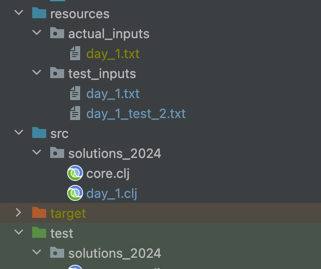
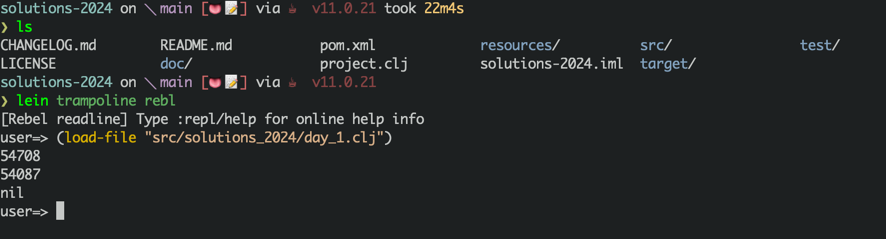

# Advent of code 2023 solutions

The answers are in clojure language.
For each day there will be a file named 

- `day_{problem_number}.clj` for all the clojure code inside the src folder

in the test_inputs directory of resources, there will be 
- `day_{problem_number}.txt` file for storing the test input.

The actual input I'm not putting inside the git intentially, 
as these are different for different users. At the end your file structure will look like this before running.

If you want test it, you can do something similar.

